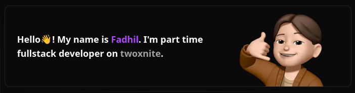
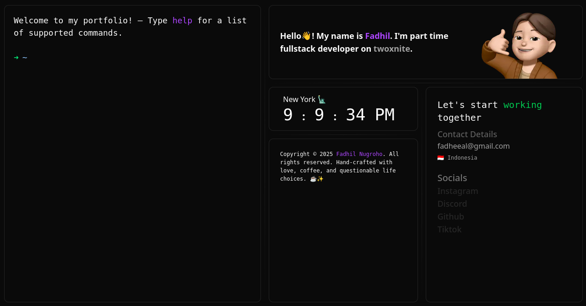

# 🗽 FADHEAL'S PORTFOLIO TERMINAL

Welcome to my **interactive portfolio** — not your average dev site!  
It's a terminal-style interface packed with personality, **real-time New York clock**, and **AI-generated quotes** to keep things fresh 🧠✨



---

## 🎯 Features

- 🖥️ **Interactive Terminal UI**  
  Navigate my projects, experience, and skills through a minimalist command-line interface.

- 🕒 **Real-Time New York Clock**  
  Stay synced with the Big Apple 🗽 — live time updates using dynamic JavaScript.

- 🧾 **Generative Quotes**  
  Get inspired with a new AI-generated quote every time you refresh.

---

## 🚀 Tech Stack

- **Frontend**: NextJS  
- **Frameworks**: ReactJS, Tailwind  
- **APIs**: Ninja API quotes API

---

## 📸 Preview



---

## 🛠️ Installation

```bash
git clone https://github.com/Fadheal/twoxnite-portfolio.git
cd your-portfolio
npm run dev
